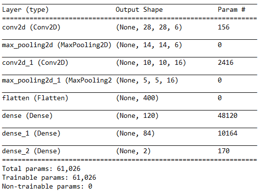
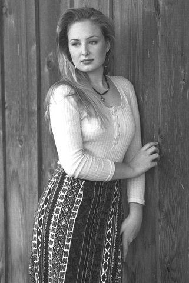
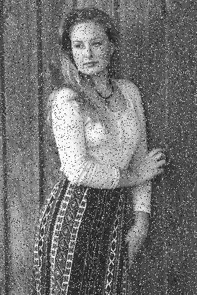
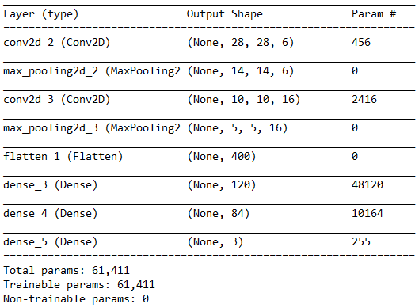
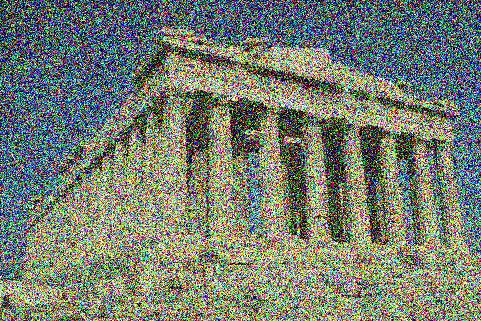
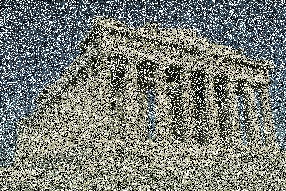

<h1> The following model represents a classification of the type of noise applied to a color or gray image. </h1>
<h4> Type of noises used are: </h4> 
- Additive Gaussian noise   
- Salt and pepper noise  

<h2> Gray images: accuracy = 98% </h2>
<h3> - Architecture of models of convolution networks </h3>
We opted to use the LeNet-5 architecture.
"LeNet-5 CNN architecture is made up of 7 layers. The layer composition consists of 3 convolutional layers, 2 subsampling layers and 2 fully connected layers."

<h3> - Result </h3>
We carried out the training of our model on a dataset of:
- 38,000 images for training
- 19000 images for validation
Salt and pepper noise was applied to the training images by scaling (the percentage of noise is increased by 5% for every 1000 group of images to increase the training areas).

The results of the compilations with an epoch = 25 are as follows:

*******************************************************************************************

Epoch 20/25  
113s 380ms/step - loss: 0.0064 - accuracy: 0.9978 - val_loss: 0.0409 - val_accuracy: 0.9901  
Epoch 21/25  
114s 383ms/step - loss: 0.0078 - accuracy: 0.9975 - val_loss: 0.0701 - val_accuracy: 0.9875  
Epoch 22/25  
113s 381ms/step - loss: 0.0040 - accuracy: 0.9987 - val_loss: 0.0965 - val_accuracy: 0.9837  
Epoch 23/25  
112s 378ms/step - loss: 0.0063 - accuracy: 0.9978 - val_loss: 0.0545 - val_accuracy: 0.9894  
Epoch 24/25  
113s 380ms/step - loss: 0.0075 - accuracy: 0.9974 - val_loss: 0.0607 - val_accuracy: 0.9883  
Epoch 25/25  
113s 379ms/step - loss: 0.0042 - accuracy: 0.9986 - val_loss: 0.0537 - val_accuracy: 0.9891  

253s 3s/step - loss: 0.1215 - accuracy: 0.9811 

********************************************************************************************
<h3> - Testing and Experimentation </h3>
For the test phase we used a dataset of 9500 images and the classification result obtained is 100%.
here are some examples of gray images with and without noise:

  <h4> Grayscale image without noise </h4>
   
  
   
  
   <h4> Grayscale image with salt & pepper noise </h4>
    
   
    

<h2> Color images: accuracy = 74% </h2>
<h3> - Architecture of models of convolution networks </h3>
We opted to use the LeNet-5 architecture.
"LeNet-5 CNN architecture is made up of 7 layers. The layer composition consists of 3 convolutional layers, 2 subsampling layers and 2 fully connected layers."

<h3> - Result </h3>
We carried out the training of our model on a dataset of:
- 57,000 images for training
- 28,500 images for validation
Salt and pepper and Gaussian noise were applied to the training images by scaling (the percentage of noise is increased by 5% for every 1000 group of images to increase the training areas).

The results of the compilations with epoch = 50 are as follows:

********************************************************************************************

Epoch 45/50  
126s 282ms/step - loss: 0.0331 - accuracy: 0.9879 - val_loss: 0.6799 - val_accuracy: 0.9207  
Epoch 46/50  
125s 281ms/step - loss: 0.0195 - accuracy: 0.9933 - val_loss: 1.8746 - val_accuracy: 0.9087  
Epoch 47/50  
126s 282ms/step - loss: 0.0266 - accuracy: 0.9905 - val_loss: 1.2452 - val_accuracy: 0.9162  
Epoch 48/50  
127s 284ms/step - loss: 0.0324 - accuracy: 0.9895 - val_loss: 1.5137 - val_accuracy: 0.9174  
Epoch 49/50  
126s 282ms/step - loss: 0.0149 - accuracy: 0.9948 - val_loss: 1.4898 - val_accuracy: 0.9112  
Epoch 50/50  
127s 284ms/step - loss: 0.0251 - accuracy: 0.9911 - val_loss: 1.9037 - val_accuracy: 0.9162  

297s 3s/step - loss: 4.6600 - accuracy: 0.7484

********************************************************************************************

<h3> - Testing and Experimentation </h3>
For the test phase we used a dataset of 14,250 images and the following results:
- For the classification of images without noise: 99.8% degree of success
- For the class of images with Gaussian noise: 86.7%
- For the class of images with salt and pepper noise: 99.6%

here are some examples of gray images with and without noise:

   <h4> Color image without noise </h4>
    
   
    
   
   <h4> Color image with gaussian noise </h4>
    
   
    
   
   <h4> Color image with salt & pepper noise </h4>
    
   
    
